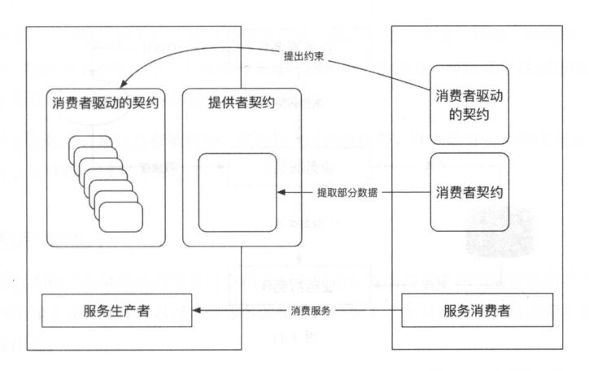

# 微服务

## 与SOA关系
>都是面向服务，但是微服务是去中心化的模式，是SOA的一种进化
>SQA也是面向服务的架构，有WebService和ESB实现，其中WebService需要中心化的服务发现目录，ESB需要服务总线。中心挂了服务也无法使用

## 微服务架构核心要点和实现原理

>职能团队划分：

>去中心化治理：不要设置中心化的管理服务，如果采用Dubbo集群方式治理服务，最差也要保证Dubbo集群挂掉后，服务降级，切换到点对点的调用

>交互模式：
>>读者容错模式：后端返回内容有变动，前端做弱校验，万不得已才抛错，否则后端一改，前端就需要同步修改
>>消费者驱动契约模式
>>>服务者契约：服务方提供什么数据，数据结构是怎么样的，通信协议是什么等等约定
>>>消费者契约：消费方需要哪些数据需要服务方来提供
>>>消费者驱动契约：代表服务方向消费方承诺遵守的约束，比如服务方承诺这个API接口是幂等的，接口是可重复调用的等等
>>>图解如下

>>去数据共享模式：会增加存储契约，需要双方约定共享数据的存取模式。数据交互需通过restful的接口或者rpc调用框架

>分解和组合模式：按照领域来划分，比如电商系统划分为订单，商品，购物车，交易等微服务。共同组合成电商完整的流程。
>>组合模式分如下
>>>服务代理模式：返回给调用端时，代理服务将后端输出进行包装才返回
>>>服务聚合模式：比如APP，会调用多个后端服务，此时APP就是一个聚合服务
>>>服务串联模式：比如工作流
>>>服务分支模式：就是调用一个后端服务，可能改后端服务需要调用另外两个后端服务，产生分支
>>>服务一部消息模式：最主要流程核心服务采用同步，其余采用异步模式
>>>服务共享数据模式：反微服务模式，但是某些情况下需要用到这种模式
>>>>单元化架构：网络通信仍然存在性能损耗，适当的将某些微服务共享同一缓存可提升性能
>>>>遗留整体服务：某些服务公用数据表耦合在同一个数据库中，不好拆分的情况下保持现状
    
**容错模式**：

>**舱壁隔离模式**
容器分组，比如使用灰度环境等
线程池隔离，不同服务使用不用线程池

>**熔断模式**
正常情况下熔断开关关闭，当请求大量超时时，打开熔断开关，对请求进行快速失败处理。
此时熔断器内容的自动检测程序对熔断服务进行检测，比如每隔几秒尝试一次，如果尝试失败，则保持开关打开，如果尝试成功，可以有两种处理
1.将熔断开关关闭，让所有请求调用服务
2.将熔断开关半开，让一条服务调用后端，如果成功，将熔断开关关闭，所有流量可以请求服务

>**限流模式**

>1.计数器

>2.令牌桶
一个线程在单位时间内生产固定数量的令牌，把令牌放到队列或者容器中，每次请求从队列或容器中获取后才有资格调用后端
否则只能等待或者直接丢弃

>3.信号量
漏斗模型，利用并发编程里的Semaphore，事先声明多少个信号量，每次执行acquire，执行外release

>**失效转移模式**：发生熔断和限流，被拒绝请求如何处理？
快速失败策略:将错误反馈给调用方，让调用方决定如何处理
备份服务处理:将请求转移到调用备份服务
failover策略，有可能是当前访问的服务器物理故障，则采用重试的方法来调用其他同级服务的服务器

>粒度
业务功能拆分，每隔服务的功能和职责单一
每个服务独立部署，扩容和缩容方便
服务拆分太细会导致服务数量较多，依赖关系复杂
总结：根据业务需求，不能拆分太粗和太细，满足上层服务对底层服务自由编排并获取更多业务服务，同时需要考虑团队人数和布局